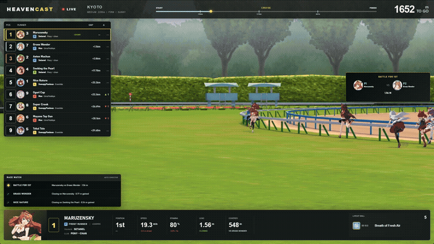

# Heaven Cast

A broadcast overlay and race-control app for Umamusume Pretty Derby streams. It watches the replay the game already loaded, works out live rankings, gaps, and race events on its own, and hands OBS a clean, transparent 1920x1080 layer to put on top of the game.

No manual spotting, no clicking through a spreadsheet mid-race. Start a 3D race and the overlay just runs.

Click the clip for the full recording with sound.

## What it does

- Five broadcast layouts, switchable per profile, each with its own read on how to present a race
- Live ranking, gaps, speed, stamina, and skill activations pulled straight from the replay
- An editorial layer that calls out leaders, closers, and battles for position as they happen
- A commentary-camera follow mode, so the featured runner panel tracks whoever the game itself is focused on
- A full-screen preview mode to check the overlay against the live game without squinting at the OBS panel
- Trainer and club attribution, with portrait and skill-icon catalogs that stay in sync with the game
- Global hotkeys for switching the featured runner and popping the native game HUD back up when you need race skip
- Profiles for module visibility, layout side, density, scale, opacity, and accent color

## Requirements

- Windows 10 or 11
- Umamusume Pretty Derby, installed and logged in
- OBS Studio, or anything else that can add a browser source

## Getting started

Grab the installer or the portable build from Releases, run it, and add an OBS browser source pointed at:

- URL: `http://127.0.0.1:5310/broadcast`
- Width: `1920`
- Height: `1080`

Open Umamusume and start any 3D race — the control room stays up between races, and race values start moving once the gates actually open. Controls, customization, and troubleshooting are covered in [USER_GUIDE.md](USER_GUIDE.md).

The releases aren't code-signed yet, so Windows will flag them on first run. Check the hash against `SHA256SUMS.txt` before telling SmartScreen to run it anyway.

## Under the hood

Replay decoding and the editorial/rendering logic run in a compiled native core, not as readable source in the release build. The app talks to itself over localhost only — no cloud service, no telemetry leaving the machine.

## License

All rights reserved. You're welcome to install and use this for your own streaming — you can't redistribute it, modify it, or fold it into something else without asking first. Full terms in [LICENSE.txt](LICENSE.txt).
